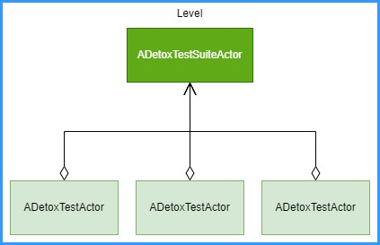

# Introduction

# Contents
1. [Setup](#setup)

# Setup
## Add The Plugin
1. Copy the `Detox` directory to the `Plugins` directory next to your `.uproject` file.
1. Copy the `Detox.Automation` directory into the `Engine/Source/Programs/AutomationTool` directory at the source version of Unreal Engine.

# Create Tests
## Overview of Detox Test Framework
Each level will include multiple test suites which derived from 'ADetoxTestSuiteActor'. Then, a test suite refer to test cases which derived from 'ADetoxTestActor'.



You can run one or mote test suites using PIE, Test Automation or Gauntlet.


## Create a Simple Test
Create a new test suite with a single test step by step:

1. Create a new level.
1. Add a 'ADetoxTestSuiteActor' to the level.
	- Usually, it's useful to create a blueprint class derived from 'ADetoxTestSuiteActor'.
	- Or, right-click in Content Browser > Create Advanced Asset > Test Automation > Test Suite Actor Blueprint.
1. Create a 'ADetoxTestActor' instance.
    - Can create a blueprint class derived from 'ADetoxTestActor' to right-click in Content Browser > Create Advanced Asset > Test Automation > Test Actor Blueprint.
1. Implement the Arrange, Act and Assert events of the test actor (see below).
1. Add an instance of the test actor blueprint to the level.
1. Add the test actor reference to the list of tests of the test suite actor.

Automated tests in the Daedalic Test Automation Plugin are built with the Arrange-Act-Assert pattern in mind:

* In _Arrange_, you should set up your test environment, get references to required actors and components, and prepare everything for the actual test.
* In _Act_, you should perform the actual action to test. Here, you're allowed to use latent actions, such as delays, to test what you want to test. Because we don't know when you're finished, you have to call _Finish Act_ when you're done.
* In _Assert_, you should use the built-in assertion framework to verify the results of your tests, e.g. check the state of variables or positions of actors.

If any of the assertions performed in the Assert step fail, the test will be marked as failed.


You can verify your test suite by entering PIE and filtering your log by the `LogDaeTest` log category.

```
LogDaeTest: Display: ADaeTestSuiteActor::RunAllTests - Test Suite: DaeTestSuiteActor_1
LogDaeTest: Display: ADaeTestSuiteActor::RunNextTest - Test: BP_TestCalculatorAddsNumbers_2
LogDaeTest: Display: ADaeTestSuiteActor::OnTestSuccessful - Test: BP_TestCalculatorAddsNumbers_2
LogDaeTest: Display: ADaeTestSuiteActor::RunNextTest - All tests finished.
```

You'll also find a handful of example tests in the Content folder of the plugin.

# License
This is released under the MIT License, and forked from [Daedalic Test Automation Plugin](https://github.com/DaedalicEntertainment/ue4-test-automation?tab=readme-ov-file#custom-test-reports).
See `Documents/LICENSE' about original "Daedalic Test Automation Plugin" license.

